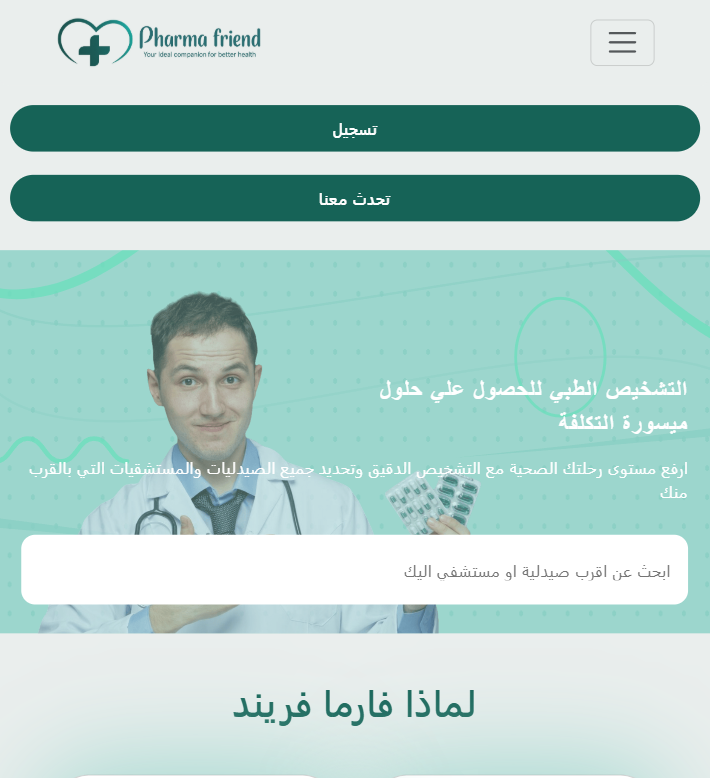
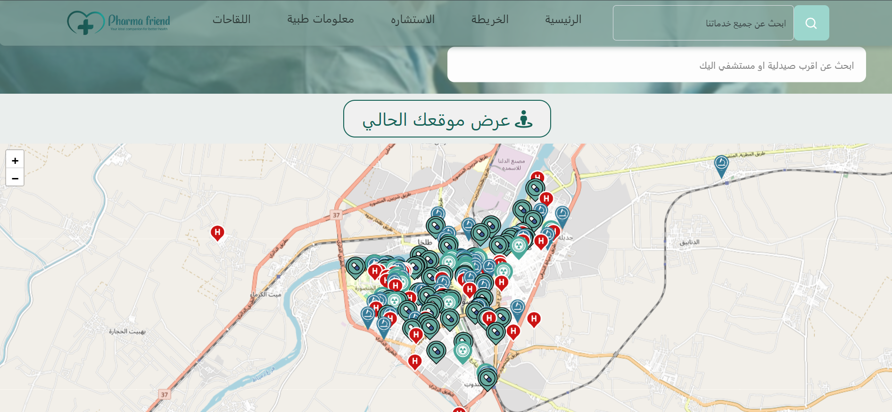
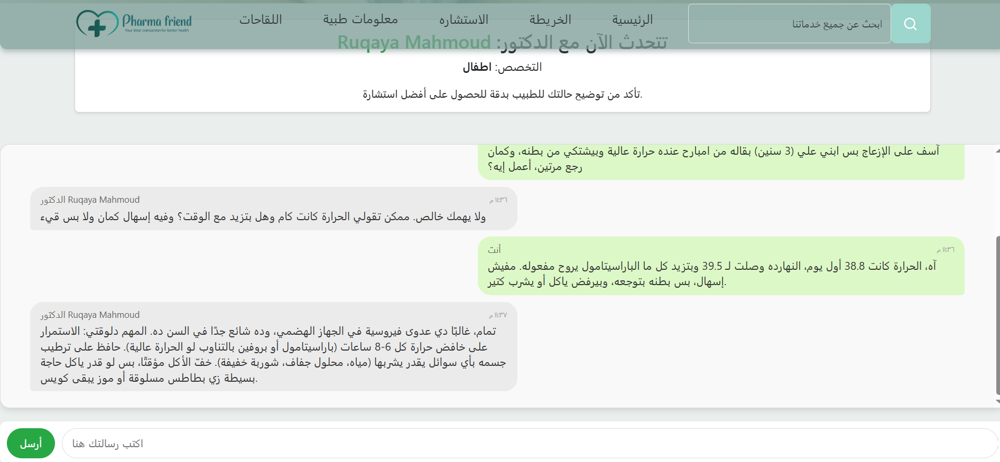

  

<h1 align="center">Pharma Friend</h1>

  
  
  
  

  Developed by <b>Osama Gamal</b> and the <b>Pharma Friend Team</b> 
  <a href="https://pharmafriend.gt.tc/pharma_friend/front/home_page.php?i=1">🔗 Live Demo</a>

---

## 🚀 About the Project

**Pharma Friend** is a comprehensive medical web platform designed to simplify healthcare access.  
It allows users to search for medicines, diseases, doctors, and nearby healthcare facilities — all from one place.

Originally developed as a **graduation project**, Pharma Friend integrates user-friendly design, interactive maps, and real-time medical data through custom APIs.

---

## 🧠 Key Features

### 1. Information Section
Search for any **medicine or disease** and view important information, health advice, and precautions.

### 2. Map Section
Interactive map displaying:
- Pharmacies  
- Doctors  
- Hospitals  
- Laboratories  
- Radiology Centers  
Each with details like working hours, contact info, and delivery options.

### 3. Doctors & Specialties
Browse by medical specialty and view doctor details including:
- Name  
- Address  
- Working hours  
- Contact methods  

### 4. Consultation
Request:
- **General consultations** for initial guidance  
- **Specialized consultations** for specific medical fields  
Includes scheduling and off-hour message handling.

### 5. User Account & Health Assistance
Once logged in, users can:
- Save health data  
- Receive **medicine reminders** and **refill alerts**  
- Get personalized health advice

---

## 🧩 Tech Stack

| Layer | Technology |
|--------|-------------|
| **Frontend** | HTML, CSS, Bootstrap, JavaScript |
| **Backend** | PHP |
| **Database** | MySQL |
| **API** | Custom PHP APIs for maps and dynamic data |

---

## 👥 Team & Roles
- **Backend Developer:** Osama Gamal  
- **Frontend Development:** Pharma Friend Team  
- **Project Type:** Graduation Project  

---

## 📷 Screenshots
> *(Add your screenshots here after uploading them — suggested size: 1200×700)*

